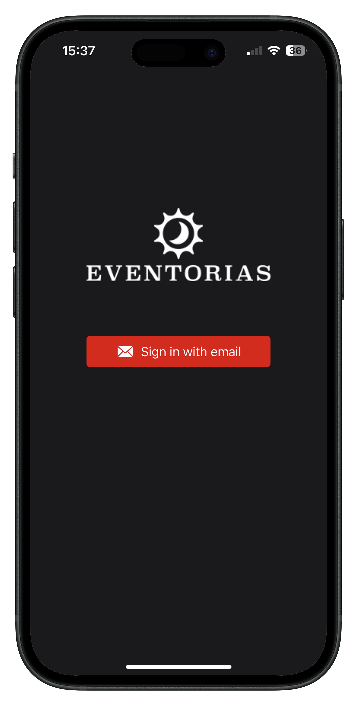
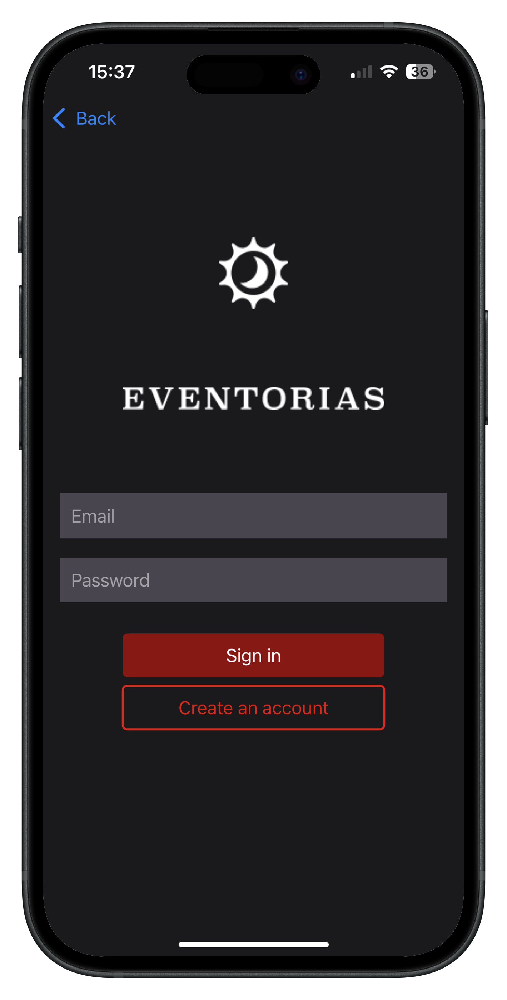
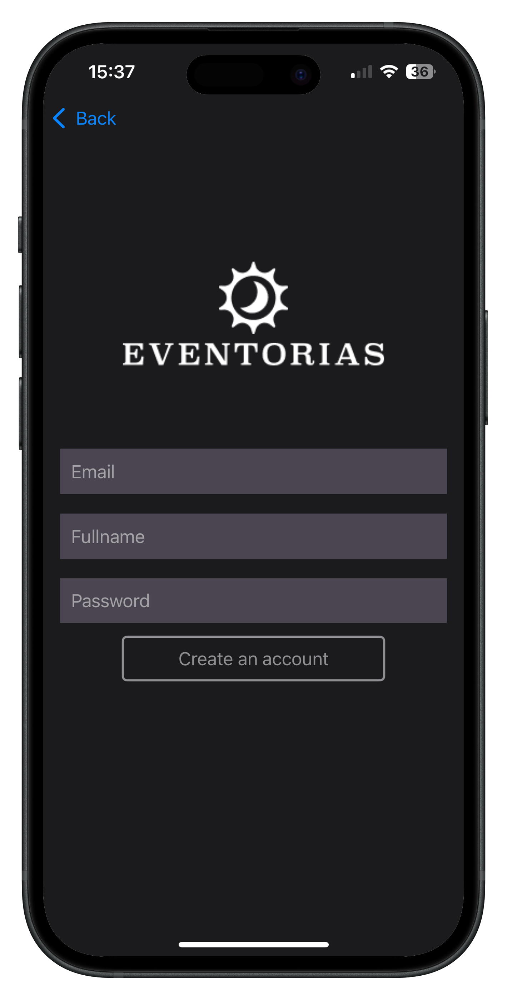
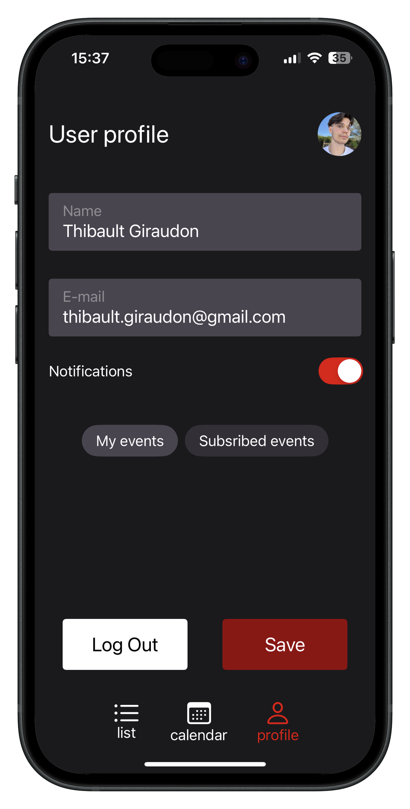
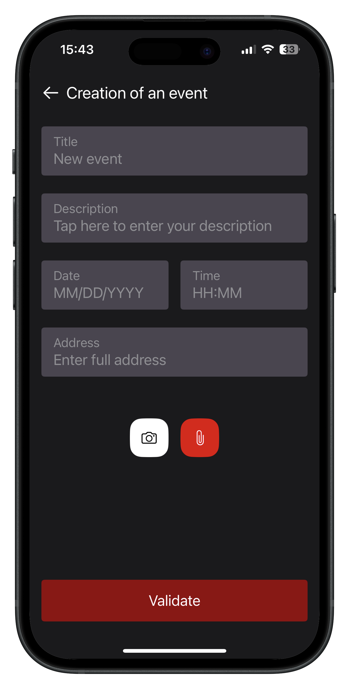
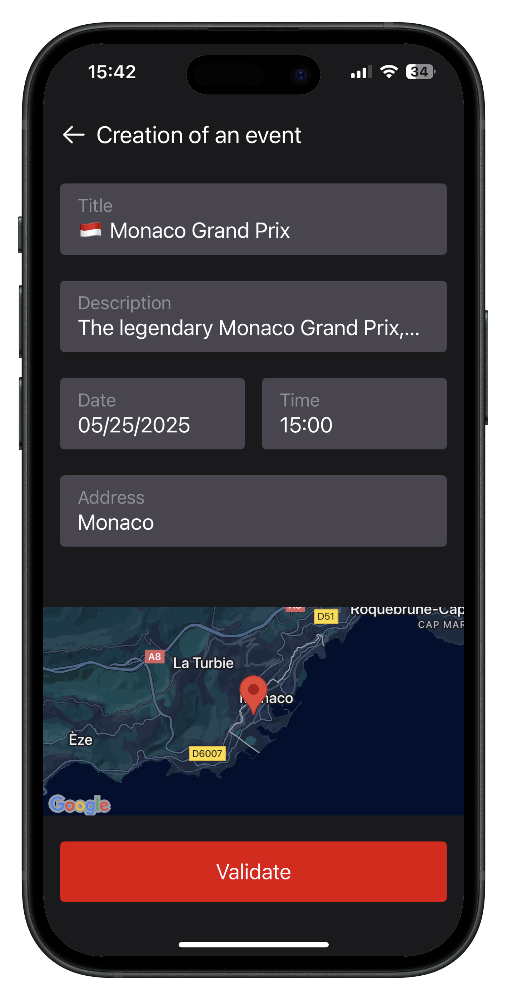
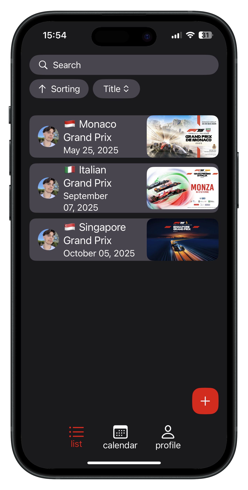
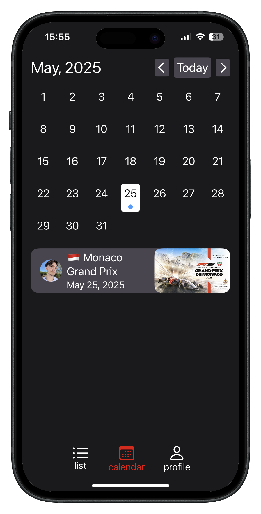

# Eventorias

## Summary

* [Description](#description)
* [Installation](#installation)
* [Features](#features)
* [Testing](#testing)

## Description
Eventorias is a mobile application developed as part of the OpenClassrooms iOS Development program.
It aims to simplify event management and discovery by allowing users to create, browse, and manage events in an intuitive and interactive way.

The app is designed with a focus on:
 - User-friendly interfaces: Users can quickly navigate between event lists, calendars, and detailed views.
 - Personalization: Profiles allow users to manage their information and preferences.
 - Efficient data management: All Firebase operations (Auth, Firestore, Storage, etc.) are encapsulated in dedicated repositories, which interact with ViewModels to keep the UI decoupled from backend logic.
 - Robust testing: Eventorias uses unit tests, integration tests, and UI/E2E tests with the Firebase Emulator Suite to ensure reliability and maintainability.

## Installation

### Clone the repository
```shell
git clone https://github.com/ThibaultGiraudon/Eventorias.git
```

---

### Create files

- #### Secrets.xcconfig
Onnthe project page tap `cmd + n`, choose `Configuration Settings File` and named it `Secrets.xcconfig`.
Then inside this file add:
```
API_KEY = googleMap_API_key
```
> [!NOTE]
> *See [this page](https://developers.google.com/maps/documentation/maps-static/get-api-key?hl=fr&setupProd=prerequisites) to get your own api key.*

---

 - #### GoogleService.plist:
Go on [Firebase](https://console.firebase.google.com/) and create a new app with your Bundle Identifier.
You can get yours following those steps :


Than add Storage and Database and Authentification. Don't forget to change the rules:

- ##### Storage:
```
rules_version = '2';


service firebase.storage {
  match /b/{bucket}/o {
    match /{allPaths=**} {
      allow read, write: if true;
    }
  }
}
```

- ##### Database:
```
rules_version = '2';

service cloud.firestore {
  match /databases/{database}/documents {
    match /{document=**} {
      allow read, write: if true;
    }
  }
}
```

## Features

### Firebase Integration 
All Firebase-related operations are encapsulated within dedicated repository classes, such as `AuthRepository`, `StorageRepository`, `UserRepositor`y, and `EventRepository`.
Each repository is responsible for interacting with a specific Firebase service, isolating implementation details from the rest of the application.
This architecture prevents direct dependencies on Firebase APIs within ViewModels or other components, making the codebase cleaner, more maintainable, and easier to refactor.
By centralizing these operations, switching to another backend provider or modifying the data layer can be done with minimal changes to the business logic.

---

### Authentication
Users can create an account, sign in, and sign out using Firebase Authentication.
The authentication logic is fully handled by the AuthRepository, accessed through the corresponding `AuthenticationViewModel`.

  

---

### Profile Editing
Authenticated users can update their profile information, such as display name, profile picture, and other personal details.
UI interactions go through a `UserSessionViewModel`, which delegates updates to the respective repository.
The `UserRepository` manages Firestore updates for profile data and the `StorageRepository` manages Firebase Storage to uploads images.



---

### Event Creation
Users can create new events by providing a title, description, date, location, and image.
The `AddEventViewModel` validates inputs and then delegates persistence to the `EventsRepository` and `StorageRepository`.

 

---

### Event Details
Users can see event's detail such as title, description, date, location and image.
The `EventViewModel` handles fetching the event's creator and the subscription.


---

### Event List & Calendar View
Events are accessible in two formats:

- List View: A scrollable list showing upcoming events with essential details.

- Calendar View: An interactive calendar displaying events on their scheduled dates.
Both views use `EventsViewModel` to retrieve data from the `EventsRepository`.

 

---

### Search & Filters
Users can search for events by applying filters such as date, title, or location.
The `EventsViewModel` handles the filtering and searching logic locally on fetched data for optimal responsiveness.

## Testing

### Install Firebase emulator
To safely test your app without touching production data, **Eventorias uses the Firebase Emulator Suite** for Firestore, Auth, and Storage.

#### **Step 1: Install the Emulator**

1. Make sure you have Node.js installed.
2. Install the Firebase CLI globally if you haven’t already:

```bash
npm install -g firebase-tools
```

3. Initialize the emulator in your project directory:

```bash
firebase init emulators
```

4. Select the services you want to emulate (Firestore, Auth, Storage).

---

#### **Step 2: Configure Ports**

* Each emulator service runs on a port. Example defaults:

  * Auth: `9099`
  * Firestore: `8080`
  * Storage: `9199`

> [!Warning]
> *Don't forget to update `EventoriasApp.swift` and `EventoriasUITests.swift` with your own port before running test.*

---

#### **Step 3: Run the Emulator**

```bash
firebase emulators:start
```

* The console will show which services are running and on which ports.
* Keep the emulator running while executing integration or UI tests.

> [!Warning]
> *Between each test don't forget to clear the emulator database, storage and authentification.*

### Unit Tests with Mocks/Fakes
All ViewModels and repositories are covered by unit tests.
ViewModels interact with fake repositories or mocks to isolate logic from Firebase and ensure predictable behavior.
This allows testing business logic, input validation, and state changes without relying on network calls or actual database operations.

### Integration Tests
Integration tests are performed to validate the interaction between repositories and Firebase services.
The Firebase Emulator Suite is used for Firestore, Auth, and Storage to simulate real backend behavior.
This ensures that repository methods correctly read/write data and handle errors in a controlled environment.

### UI Tests
UI tests verify end-to-end user flows, from authentication to event creation and listing.
Tests run against the app using mocked data or the Firebase Emulator for a realistic environment.
This guarantees that the UI responds correctly to user actions, displays the right data, and handles errors gracefully.

### Overall Architecture
The combination of unit, integration, and UI tests ensures that:

 - Logic in ViewModels is correct and maintainable.
 - Firebase interactions behave as expected.
 - The app’s user interface is robust and reliable.
